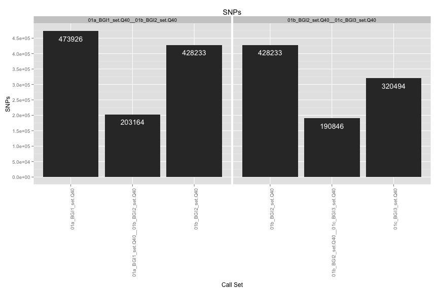
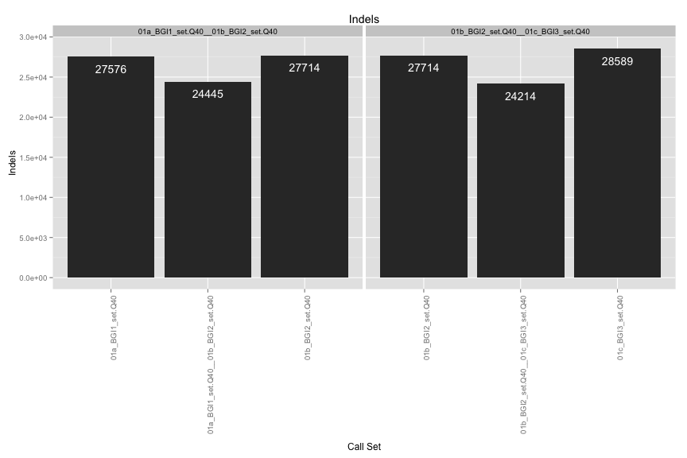
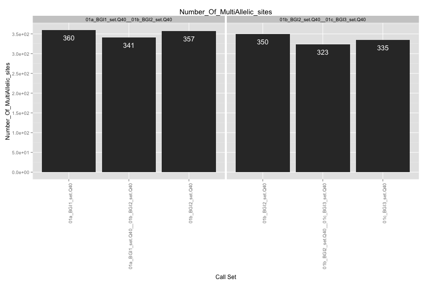
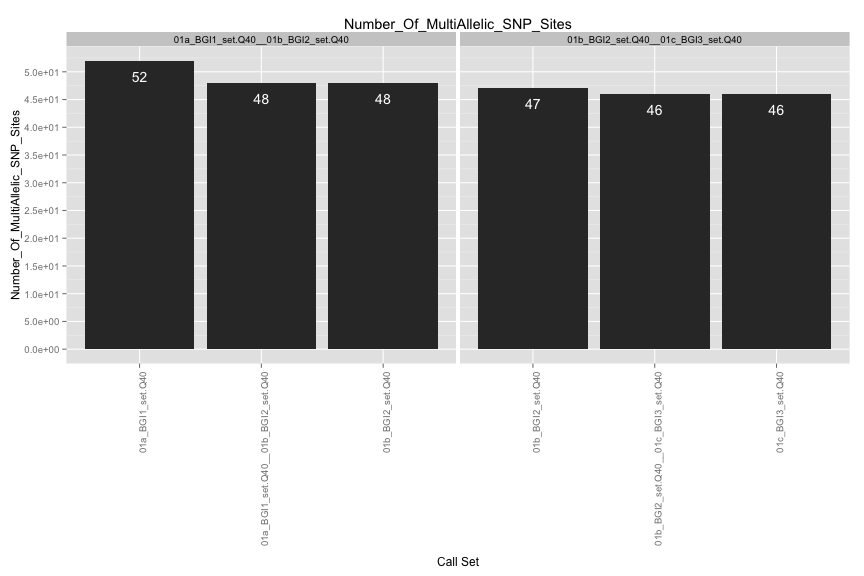
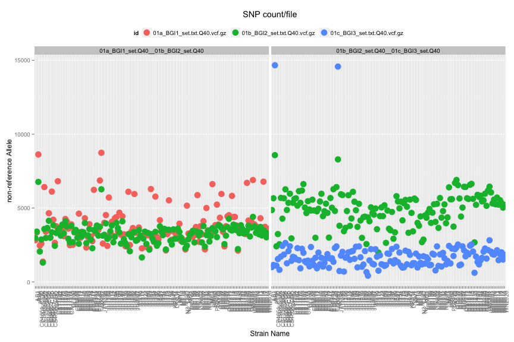
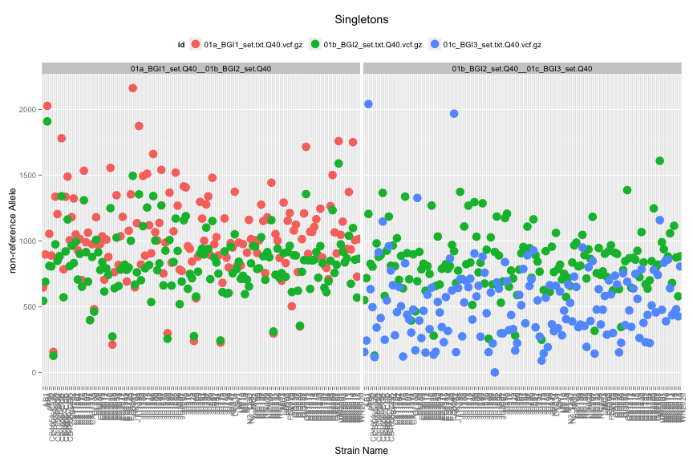
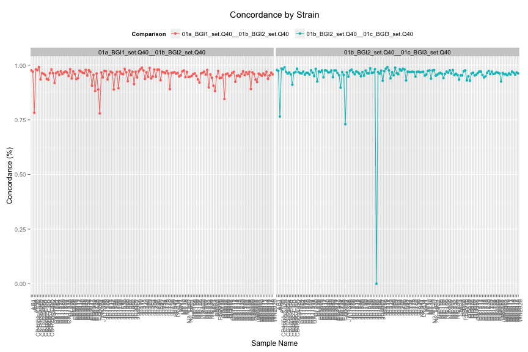
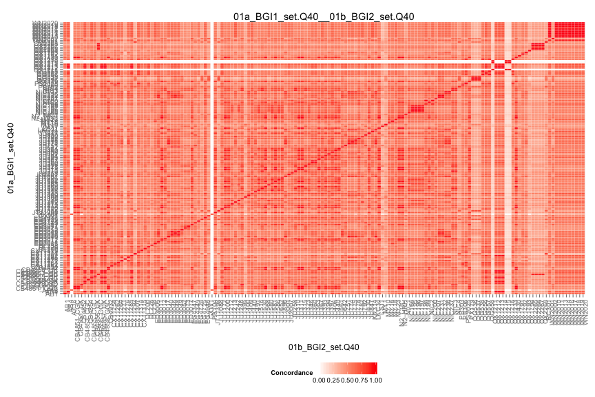
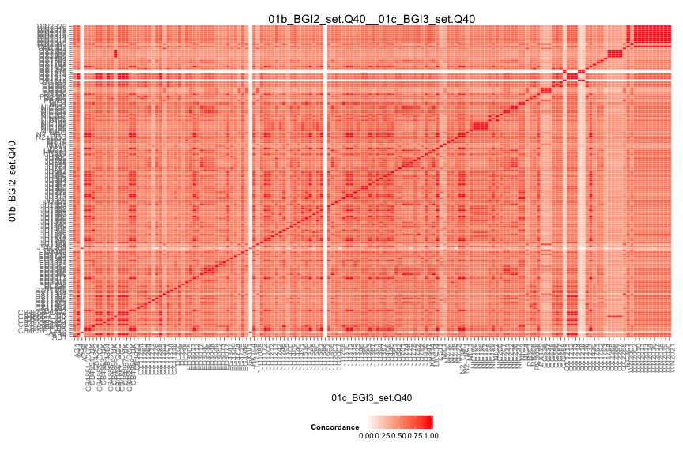

VCF Compare Script
==================

## Files

[1] "01a_BGI1_set.txt.Q40.vcf.gz" "01b_BGI2_set.txt.Q40.vcf.gz"
[3] "01c_BGI3_set.txt.Q40.vcf.gz"

## Individual VCF Results
    

# Number of SNPs/Strain

 

# Singletons
 

## Ind. Sample Concordance

 

## Pairwise Concordance

[[1]]
 
[[2]]
 

