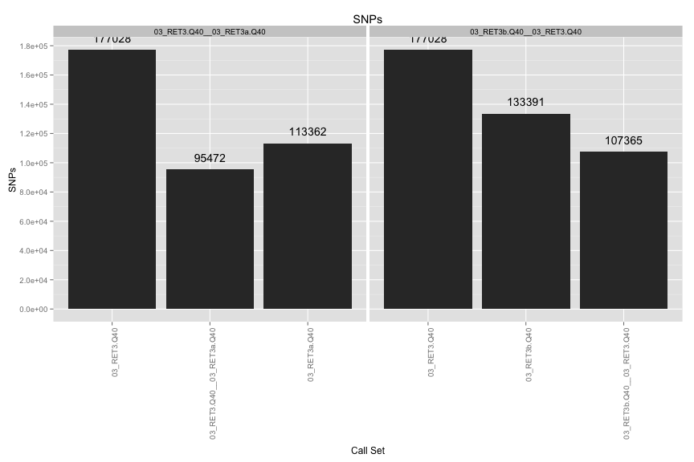
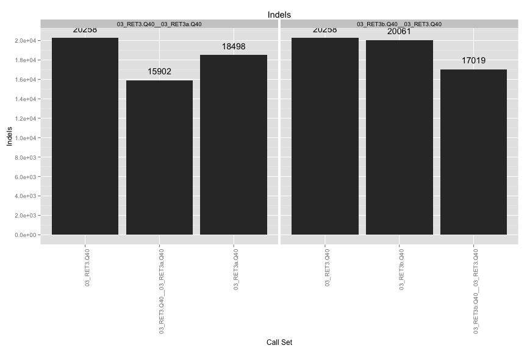
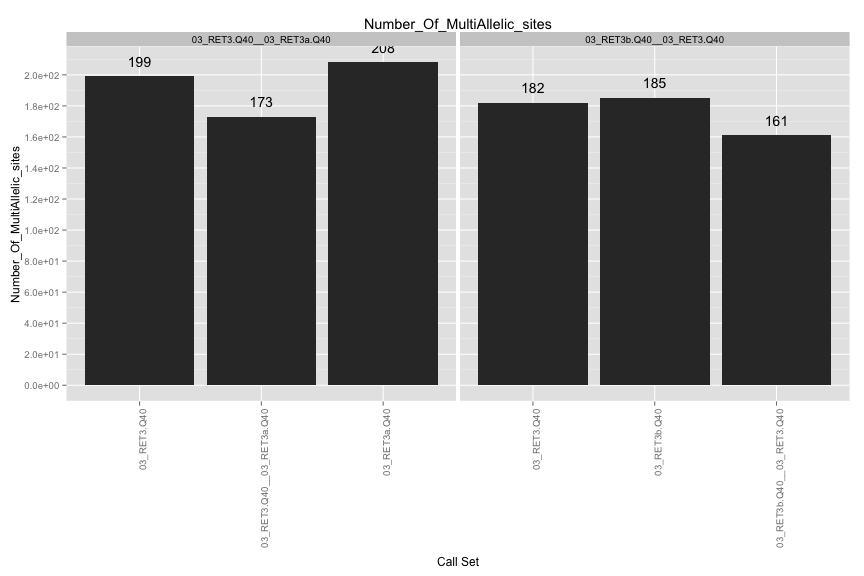
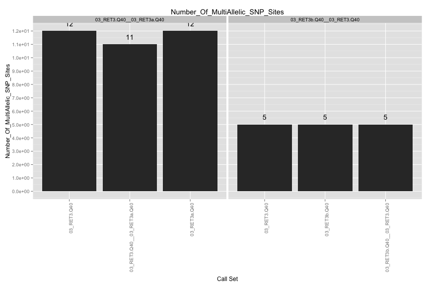
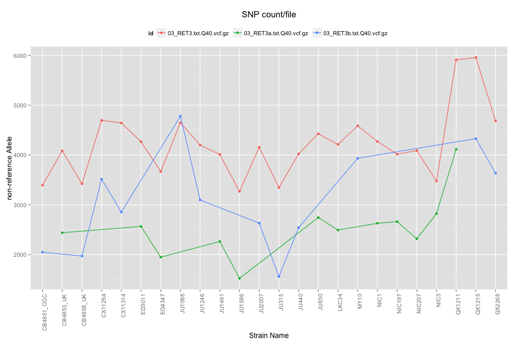
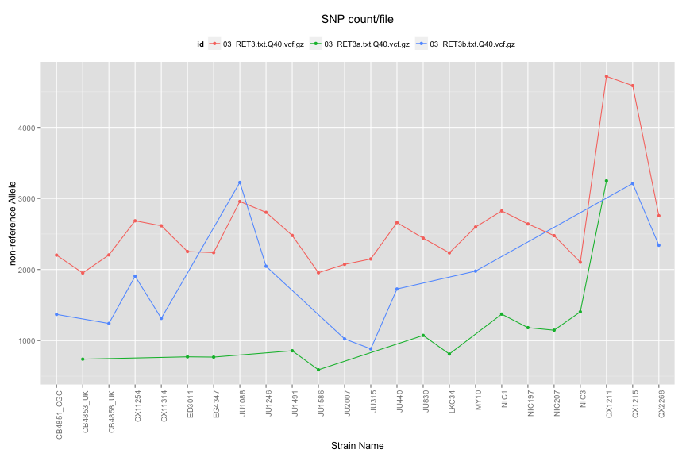
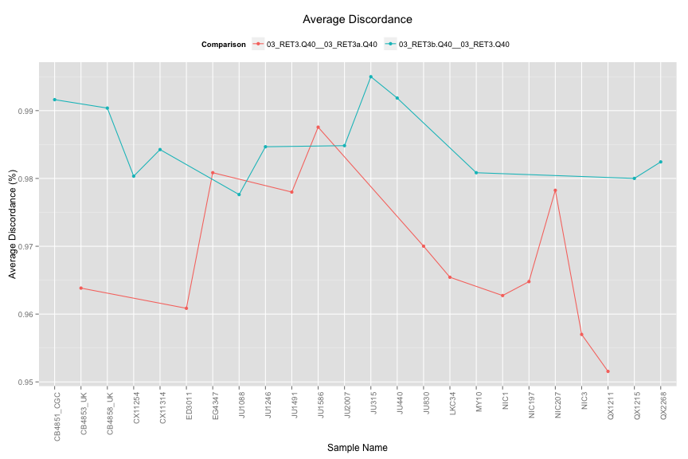
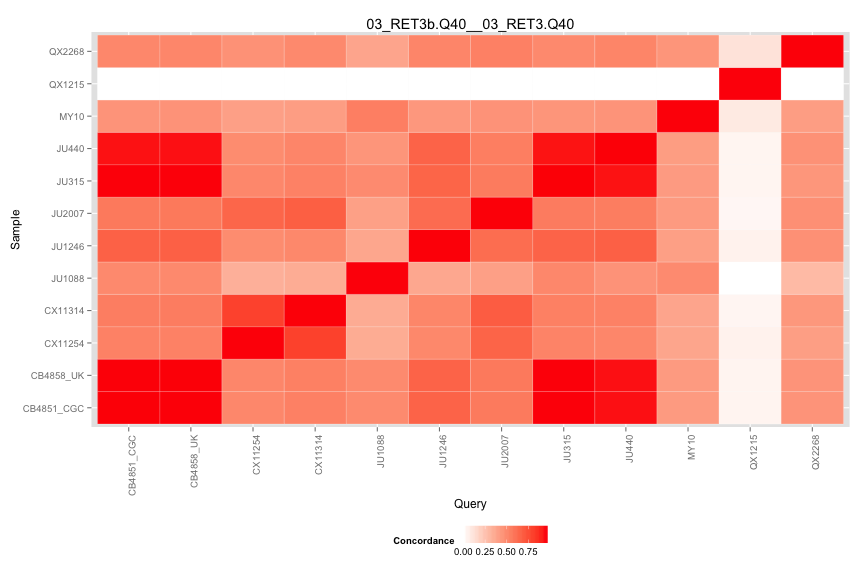
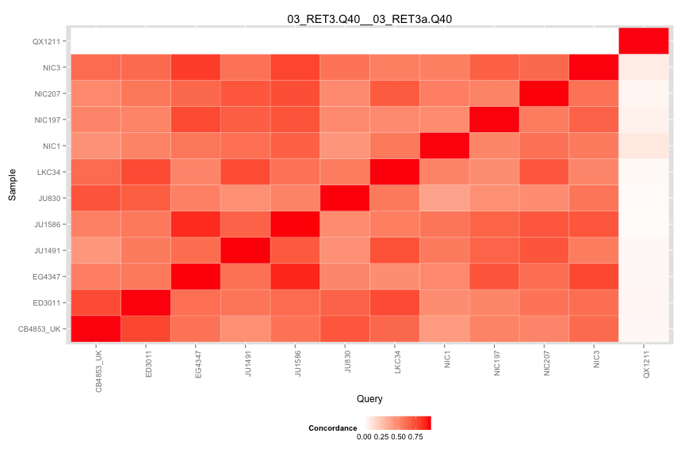

#/usr/bin/R

VCF Compare Script
==================

## Files

[1] "03_RET3b.txt.Q40.vcf.gz" "03_RET3.txt.Q40.vcf.gz" 
[3] "03_RET3a.txt.Q40.vcf.gz"

## Individual VCF Results
    

  

## Ind. Sample Concordance #

 

## Pairwise Concordance

[[1]]
 
[[2]]
 

