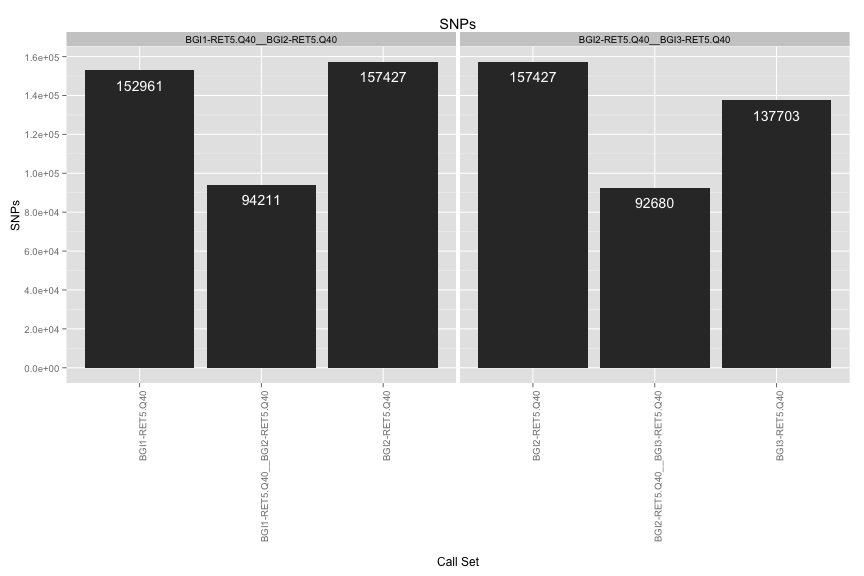
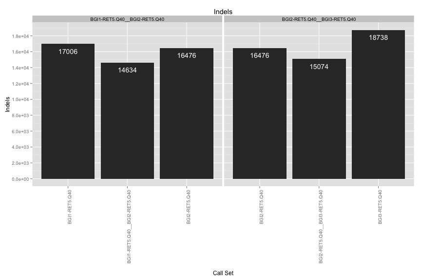
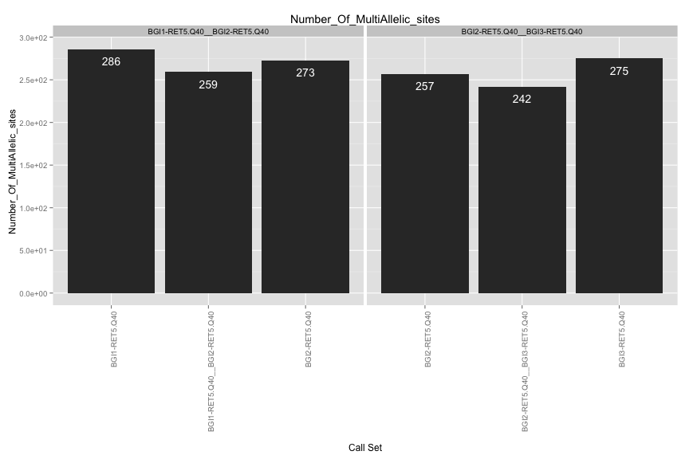
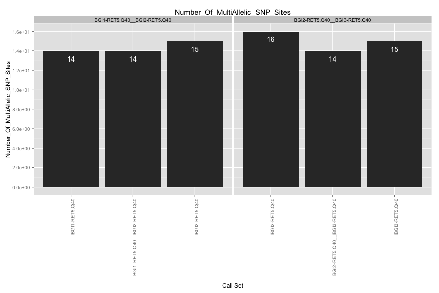
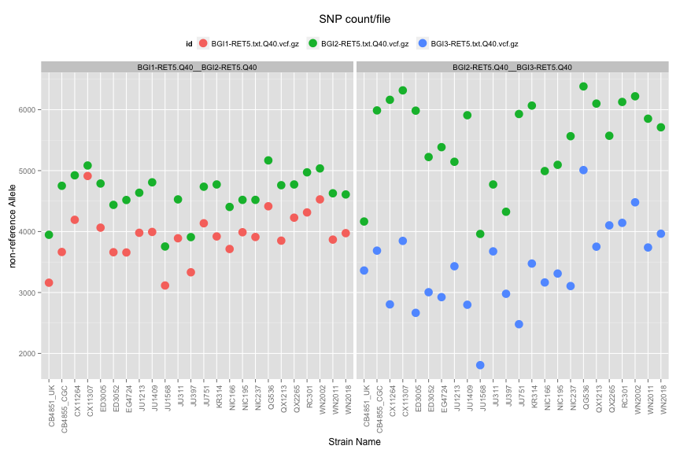
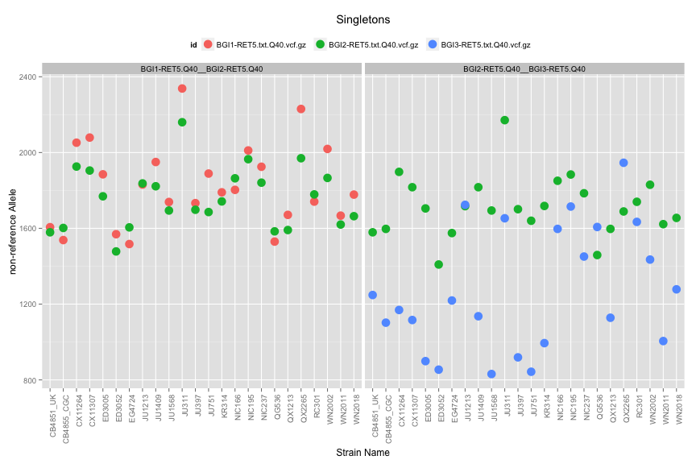
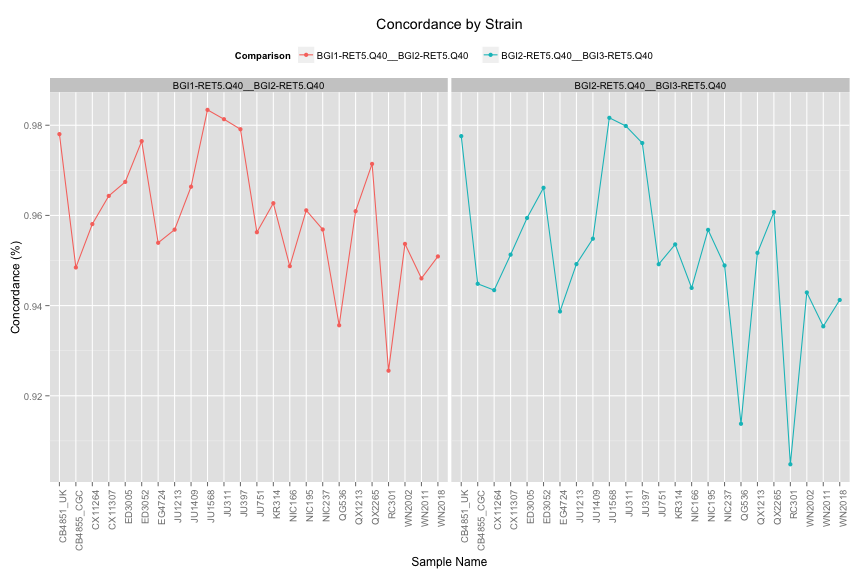
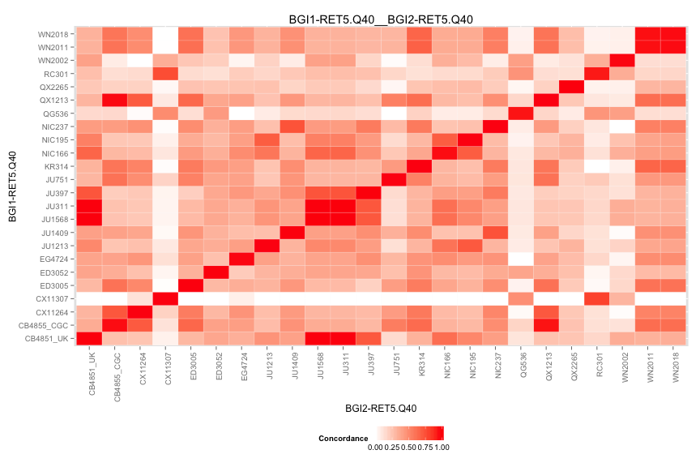
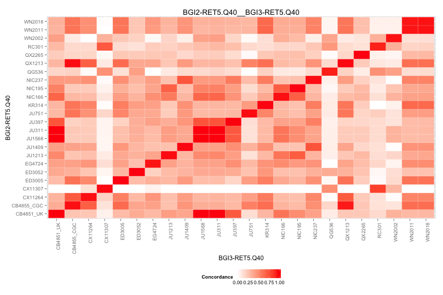

VCF Compare Script
==================

## Files

[1] "BGI1-RET5.txt.Q40.vcf.gz" "BGI2-RET5.txt.Q40.vcf.gz"
[3] "BGI3-RET5.txt.Q40.vcf.gz"

## Individual VCF Results
    

# Number of SNPs/Strain

 

# Singletons
 

## Ind. Sample Concordance

 

## Pairwise Concordance

[[1]]
 
[[2]]
 

