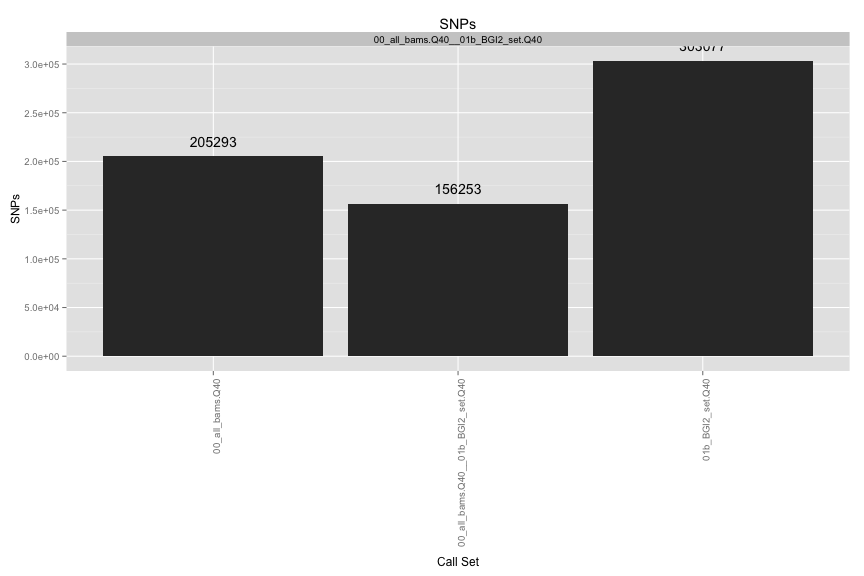
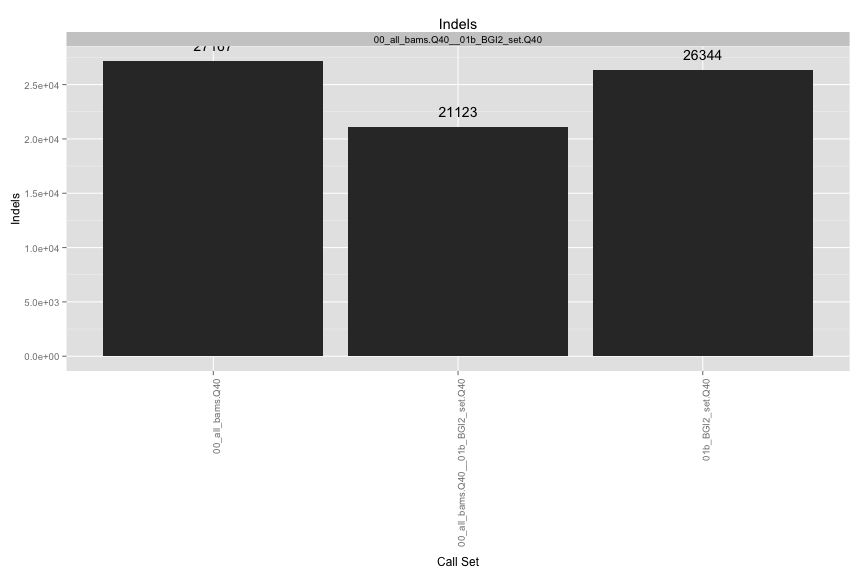
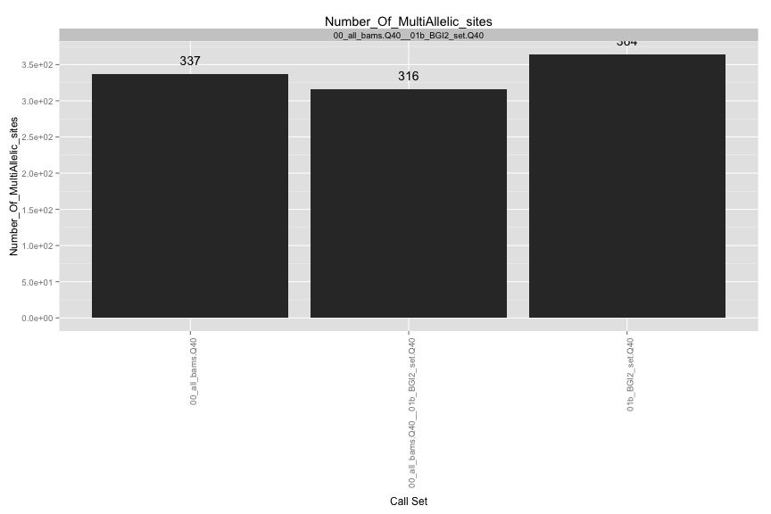
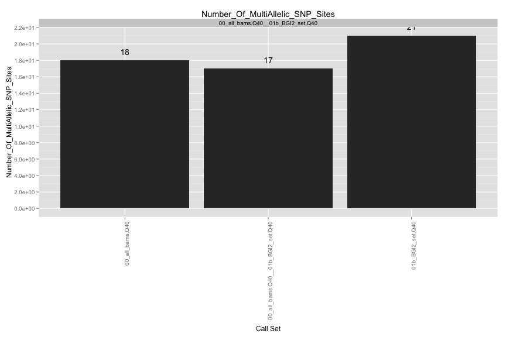
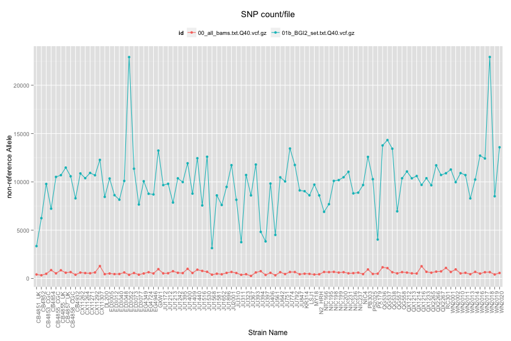
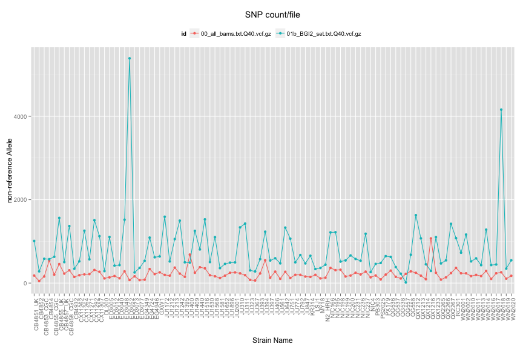
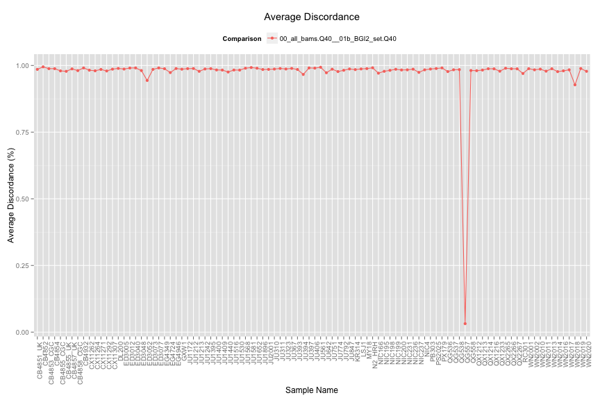
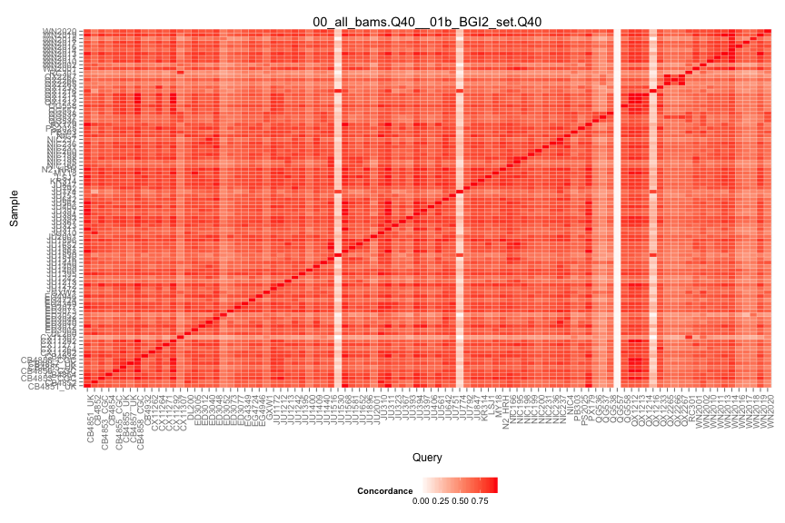

#/usr/bin/R

VCF Compare Script
==================

## Files

[1] "00_all_bams.txt.Q40.vcf.gz"  "01b_BGI2_set.txt.Q40.vcf.gz"

## Individual VCF Results
    

  

## Ind. Sample Concordance #

 

## Pairwise Concordance

[[1]]
 

