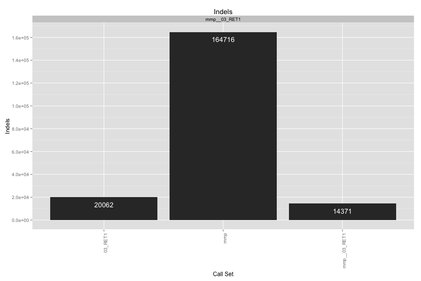
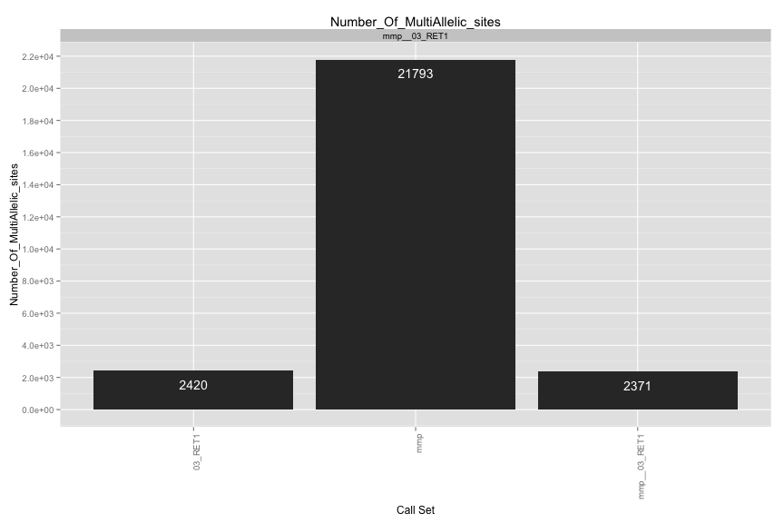
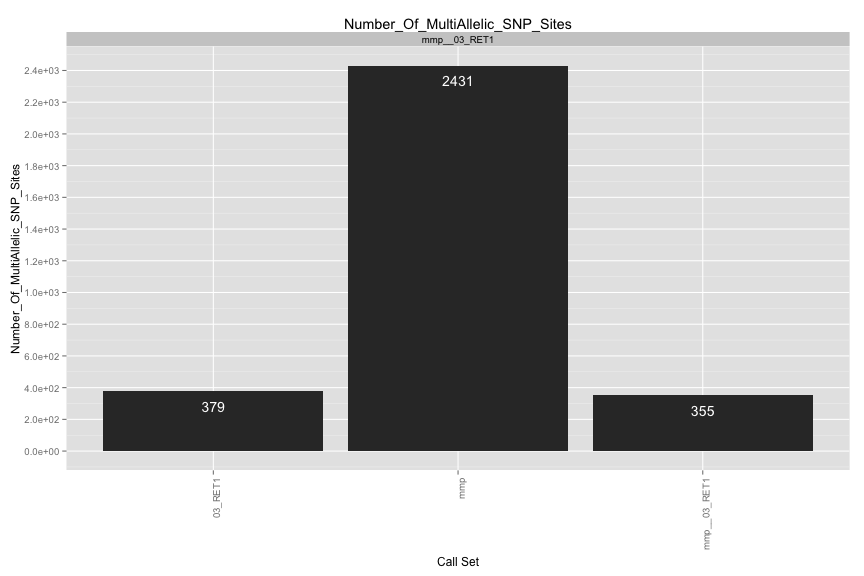
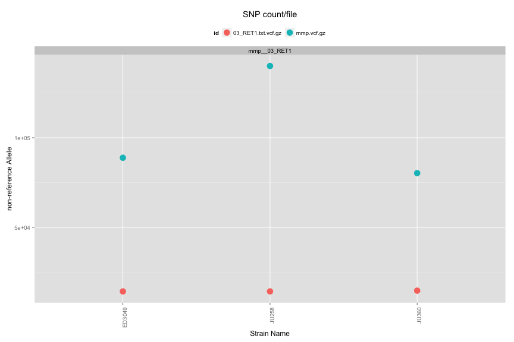
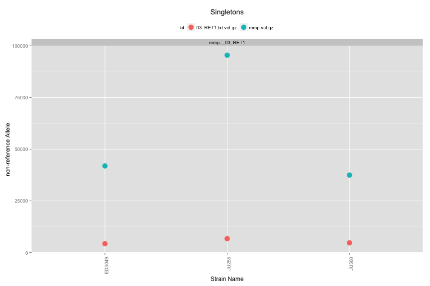
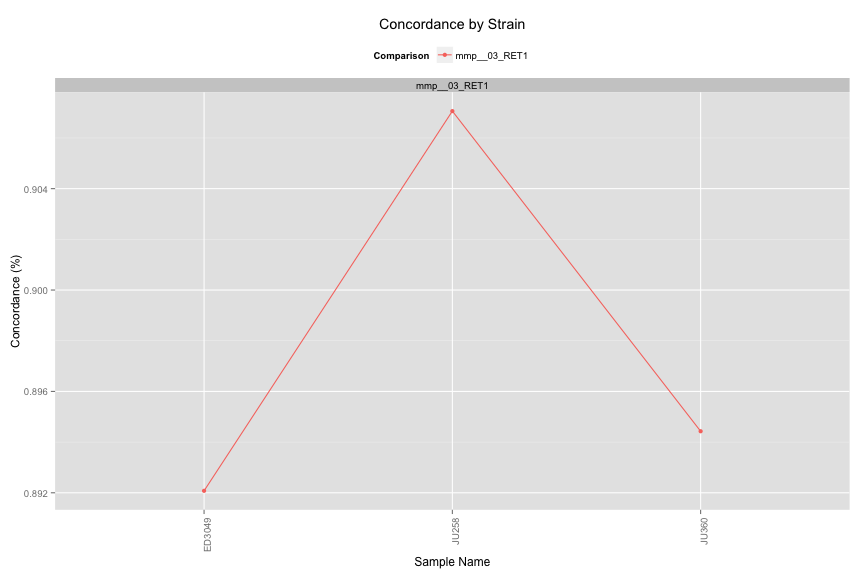

VCF Compare Script
==================


## Files

[1] "mmp.vcf.gz"         "03_RET1.txt.vcf.gz"


## Individual VCF Results
    


# Number of SNPs/Strain

 


# Singletons
 


## Ind. Sample Concordance

 


## Pairwise Concordance


```
## Error: subscript out of bounds
```

