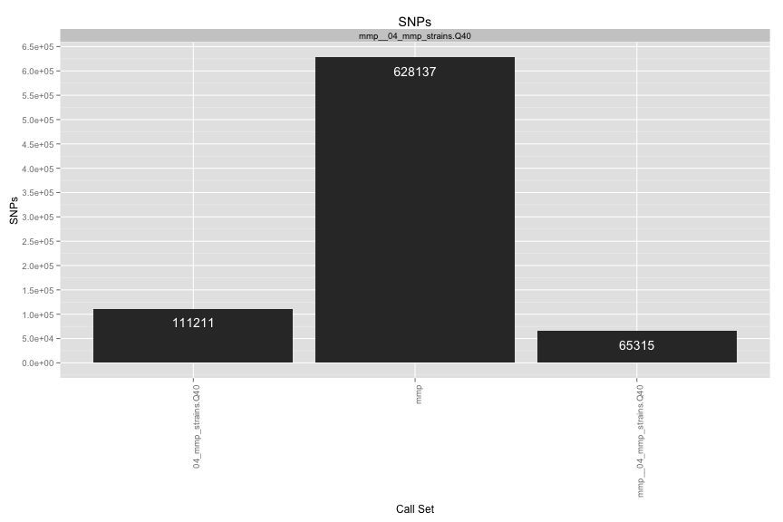
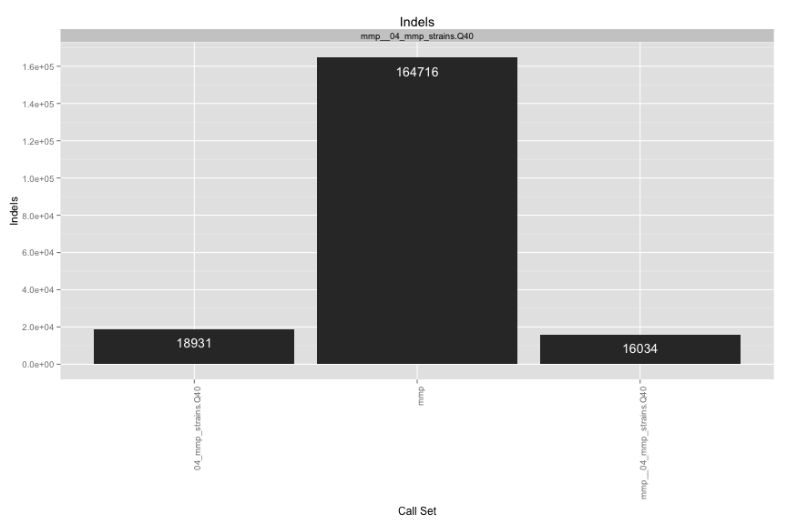
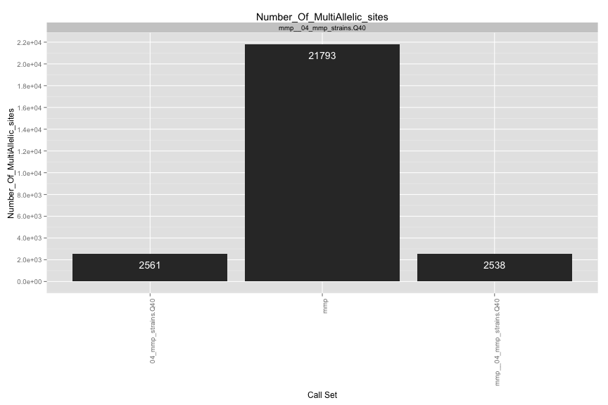
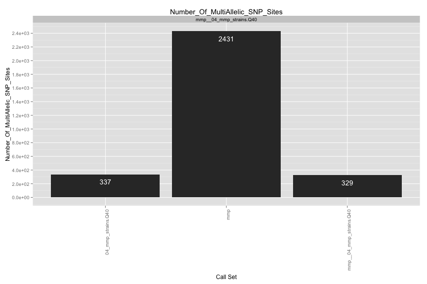
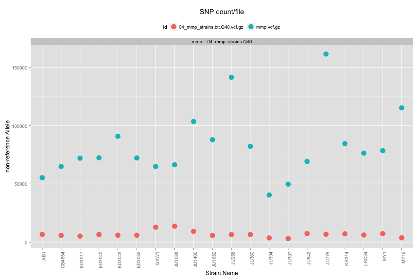
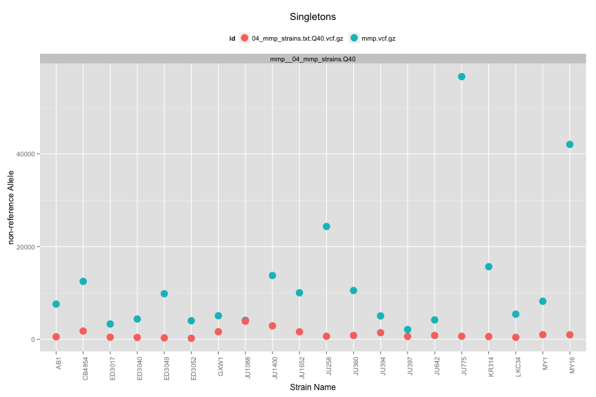
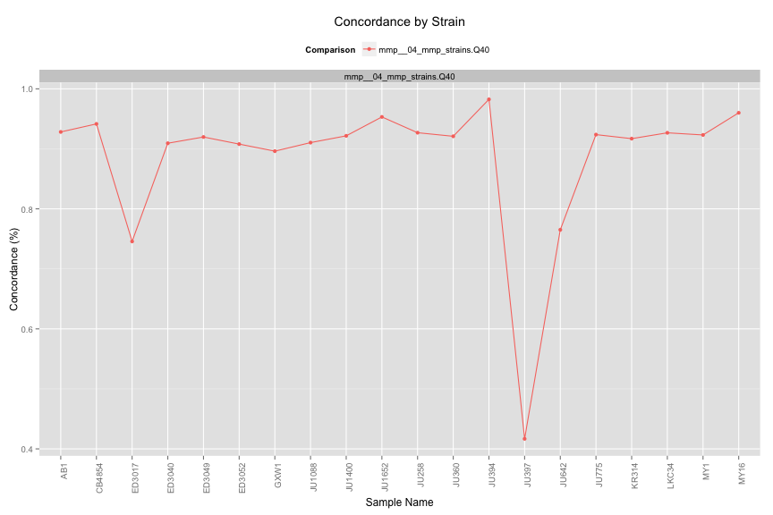
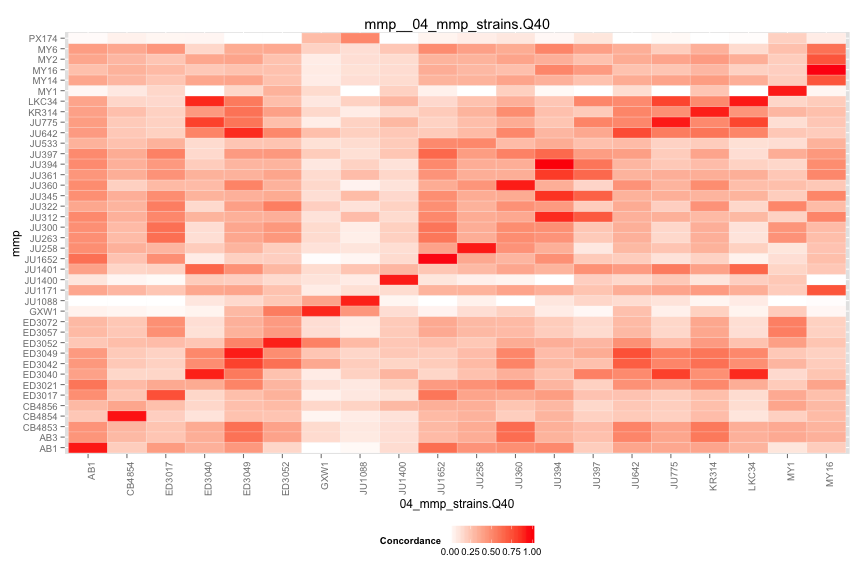

VCF Compare Script
==================

## Files

[1] "mmp.vcf.gz"                    "04_mmp_strains.txt.Q40.vcf.gz"

## Individual VCF Results
    

# Number of SNPs/Strain

 

# Singletons
 

## Ind. Sample Concordance

 

## Pairwise Concordance

[[1]]
 

